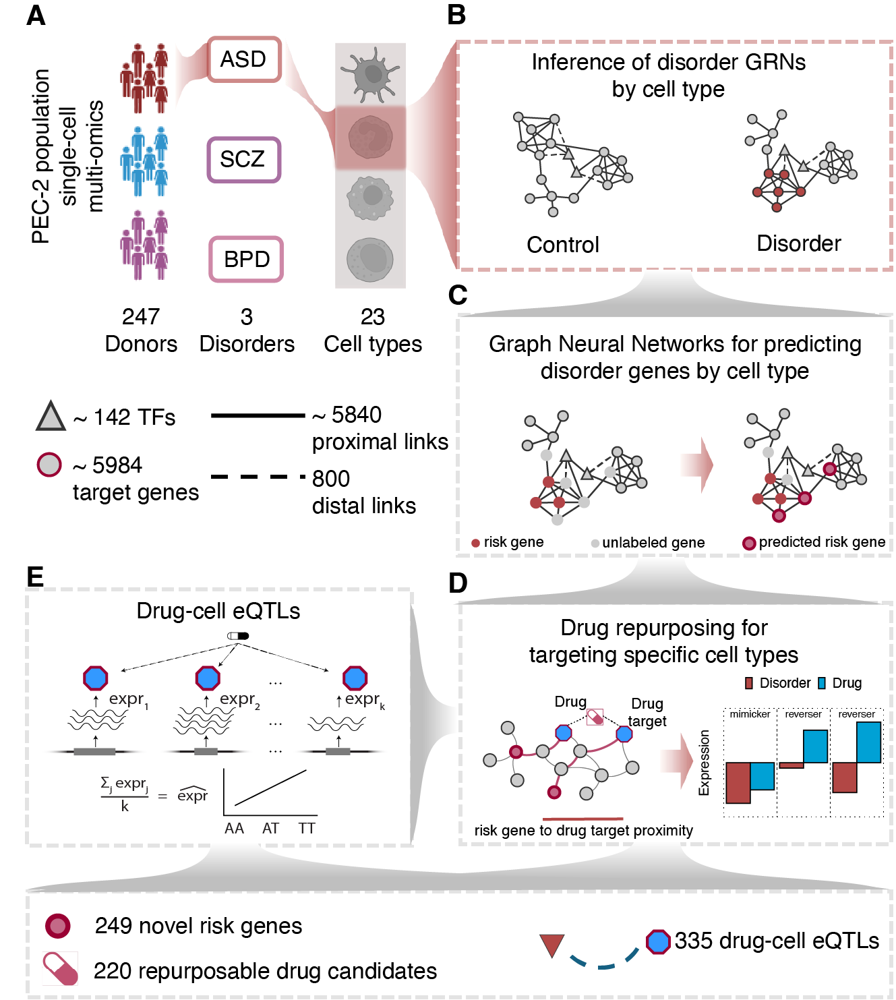

# PEC2 NetMed

**Population-scale single-cell network medicine for neuropsychiatric disorders**

Neuropsychiatric disorders lack effective treatments due to a limited understanding of underlying cellular and molecular mechanisms. To address this, we integrated population-scale single-cell genomics data and analyzed cell-type-level gene regulatory networks across schizophrenia, bipolar disorder, and autism (23 cell classes/subclasses). Our analysis revealed potential druggable transcription factors co-regulating known risk genes that converge into cell-type-specific co-regulated modules. We applied graph neural networks on those modules to prioritize novel risk genes and leveraged them in a network-based drug repurposing framework to identify 220 drug molecules with the potential for targeting specific cell types. We found evidence for 37 of these drugs in reversing disorder-associated transcriptional phenotypes. Additionally, we discovered 335 drug-cell QTLs drug-associated cell-type eQTLs, revealing genetic variation's influence on drug target expression at the cell-type level. Our results provide a single-cell network medicine resource that provides mechanistic insights for advancing treatment options for neuropsychiatric disorders.

---


---

## System Requirements

These codes have been tested on
- OS: MacOS 14.6.1
- R version: 3.9.16  
- Required R packages (tested versions):

```r
Heatplus=3.10.0
vegan=2.6.10
viridis=0.6.5
data.table=1.17.0
ggplot2=3.5.2
dplyr=1.1.4
tidyr=1.3.1
GenomicRanges=1.54.1
minet=3.60.0
RColorBrewer=1.1.3
ggsci=3.2.0
ComplexHeatmap=2.18.0
corrplot=0.95
tidyverse=2.0.0
scales=1.4.0
ggthemes=5.1.0
Rtsne=0.17
circlize=0.4.16
GSA=1.3.3
ggh4x=0.3.0
ComplexUpset=1.3.3
readxl=1.4.5
PRROC=1.4
e1071=1.7.16
randomForest=4.7.1.2
stringr=1.5.1
igraph=2.1.4
reshape2=1.4.4
WGCNA=1.73
flashClust=1.1.2
```

---

## Installation

Clone the repository and navigate into the directory:

```bash
git clone https://github.com/daifengwanglab/PEC2NetMed.git
cd PEC2NetMed
```

---

## Download Data

Run the following script to download the required datasets:

```bash
./download_data.sh
```

---

## Reproduce figures in manuscript
Example from the command line:

```bash
Rscript scripts/2D.R
```

Or from within an interactive R session:

```r
source('scripts/2D.R')
```

---

## 📄 Citation

If you use this code or data in your research, please cite:

> _Author Names_. **Title of the manuscript**. _Journal Name_, Year. DOI (To be updated).

---

## 📝 License

MIT License. See [LICENSE](LICENSE) file for details.

---
